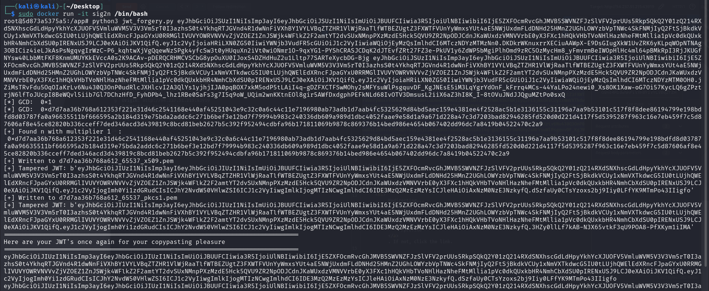
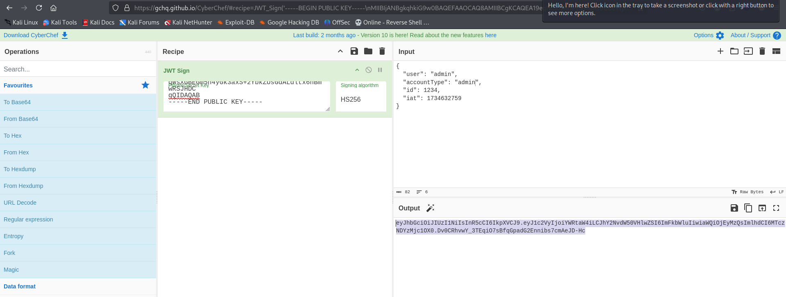
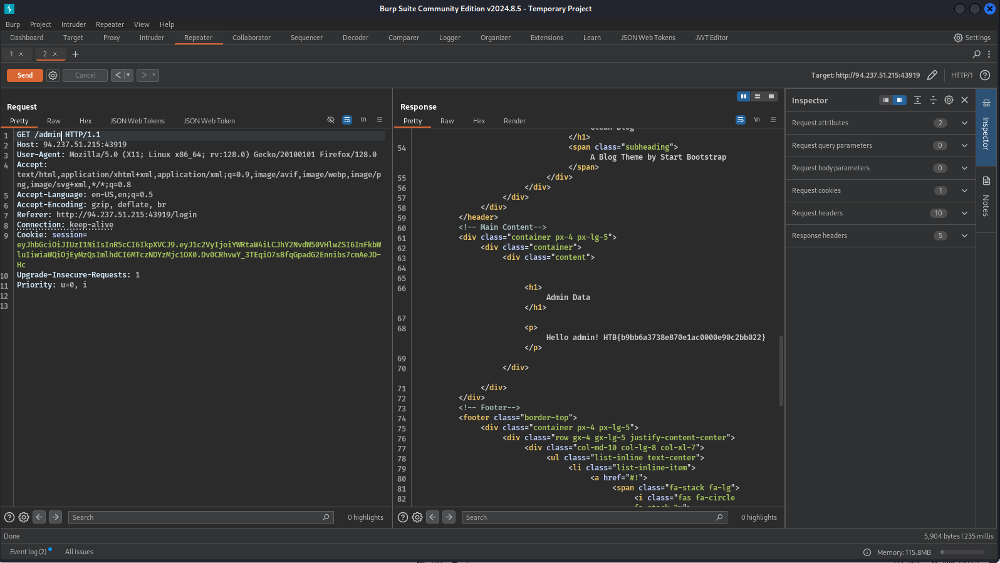

# Writeup

To solve the lab, we need to exploit an Algorithm Confusion vulnerability in JWT.

1. First, we need to login twice to forge 2 JWT tokens, or, just repeat the request in burp repeater.
2. Then, we need to use **sig2n** to analyze the tokens, forge a JWT Token using Algorithm Confusion and pickup the key in the .pem file

3. After that, we need to analyze the JWT in https://jwt.io/, pickup the payload, change "user" and "accountType" values to "admin" and sign the JWT using the key. Use `https://gchq.github.io/CyberChef/#recipe=JWT_Sign('secret','HS256')` to sign and don't forget to add a new line in the key.

4. With the forged token, access admin panel and retrieve the flag.

